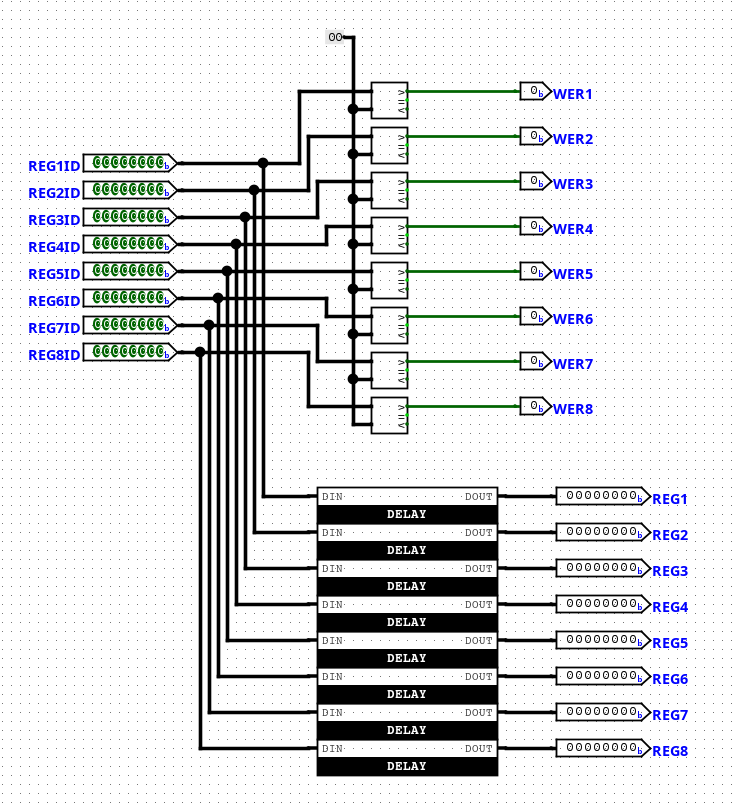
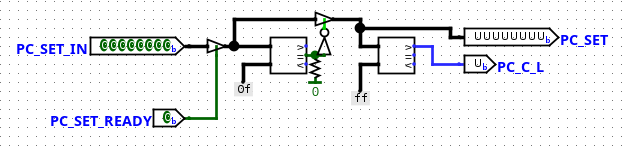
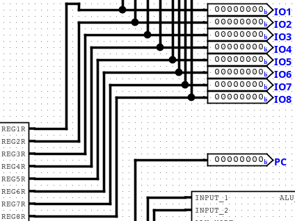
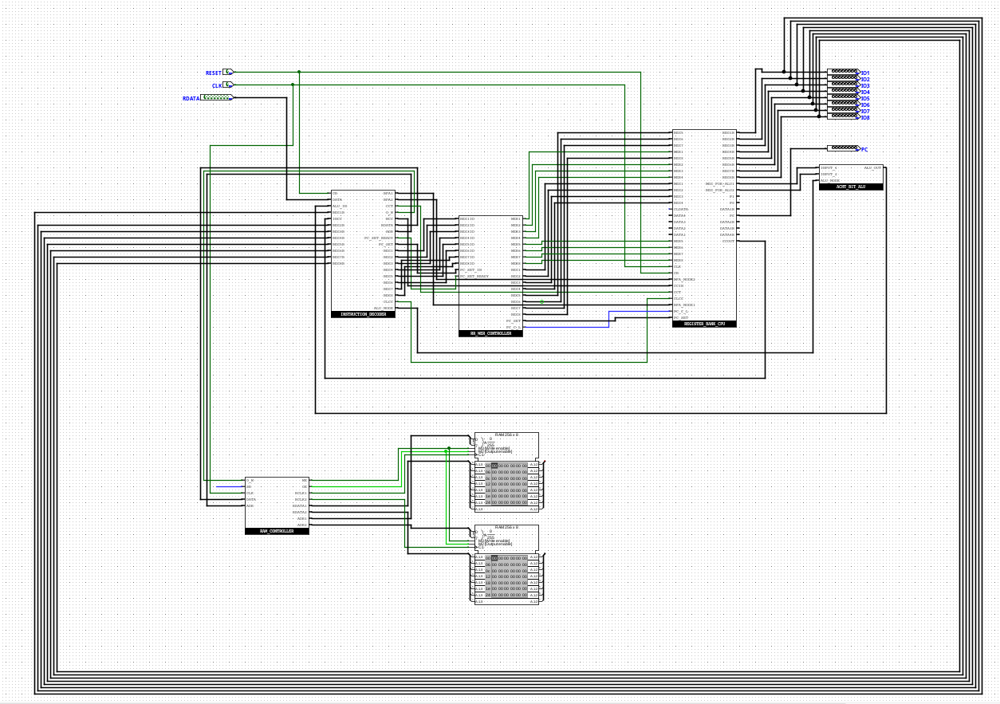
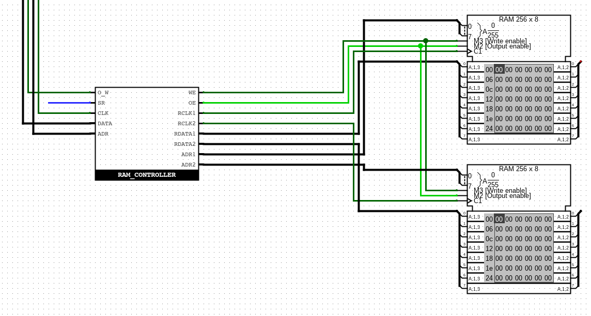

# No1-Own-CPU

## Directory
- [Specs](#my-cpu-is-similar-to-a-risc-cpu)
  - [WER_CONTROLLER](#wer_controller-write-enable-register-controller)
  - [8 I/O Ports](#the-8-io-ports)
- [More Pictures](#more-pictures)
- [Thanks / Credits](#thanks-and-credits)

## My CPU is similar to a RISC CPU
- SPECS:
  - 16 Registers:
    - 8 Main Registers
    - 4 Data Registers (Not used yet)
    - 1 PC (Programcounter)
    - 1 CC (Command Cache; Especially for the MOV command)
    - 1 P0 (Just 0 in it)
    - 1 P1 (Just 1 in it)
  - 1 Instruction decoder
  - 1 Write Enable Register Controller ([Explained Below](#wer_controller-write-enable-register-controller))
  - 1 RAM controller and two RAM banks with 256 bytes each
  - 1 lightweight ALU
  - 8 I/O Ports ([Explained Below](#the-8-io-ports))
  - 1 CR (Complete Reset)
  - 1 Clock Input (Soon with its own clock)
  - 1 ROM input for Instructions

## WER_CONTROLLER (Write Enable Register Controller)
  The WER_CONTROLLER, also called the Write Enable Register Controller, 
  is designed to enable Write Enable exactly when the clock pulse arrives and then, 
  with a short delay, send the data. 
  Here's a picture:

  

  In the picture, you can see the inputs REGID1 to REGID8, 
  which stand for Register Instruction Decoder. 
  These are the inputs of the instruction decoder. 
  The outputs are WER1 to WER8 and REG1 to REG8. 
  WER stands for Write Enable Register, and REG stands for Register.

  ---

  To ensure that the data is correctly routed to the PC (Program Counter) 
  so that a new value can be loaded, we use this part of the WER_CONTROLLER:

  

  This has two inputs and two outputs. The first input, PC_SET_READY, is used to tell the logic to pass the PS_SET_IN value.
  Then it checks whether the given value is the command itself (because that was a bug). 
  If not, the address is passed through. Then there is the PC_SET output, which passes the specified address to the counter. 
  The PC_C_L tells the counter whether it should continue counting normally or load a specified value.

## The 8 (I/O) Ports
  Since my CPU is still in beta, the 8 (I/O) ports are only connected to the 8 main registers. 
  These are located on pins REG1R to REG8R. REG#R stands for Register # Read.
  Here's an image:

  

## More pictures
  This is the Main Place from the CPU:

  

  Here are the RAM Banks and the Controller:

  

  

